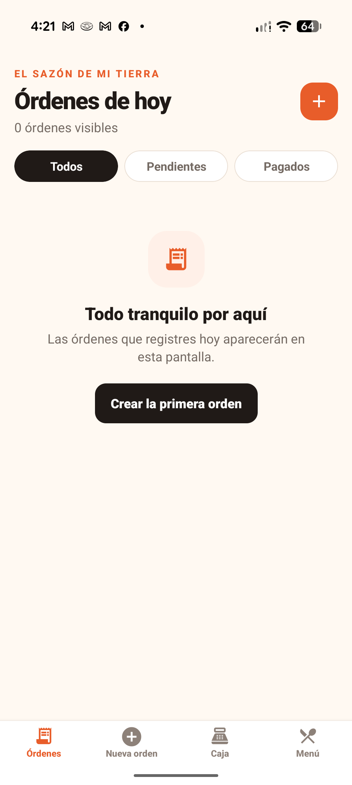
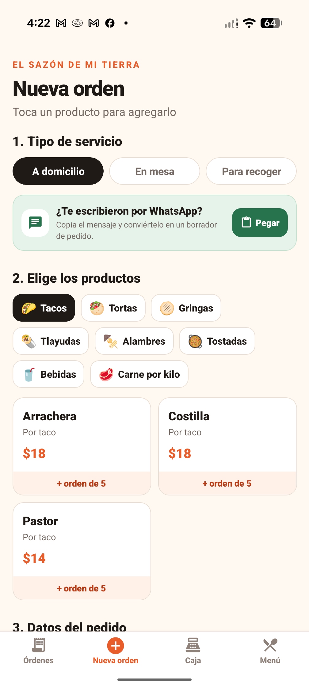
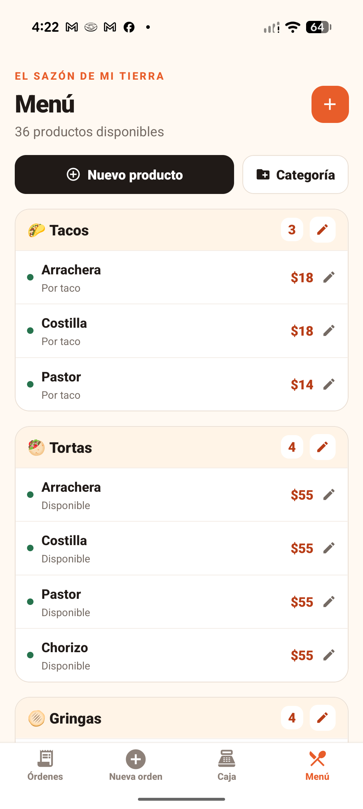
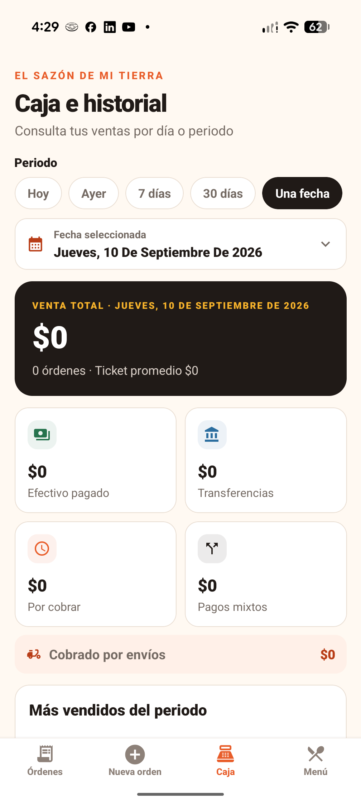
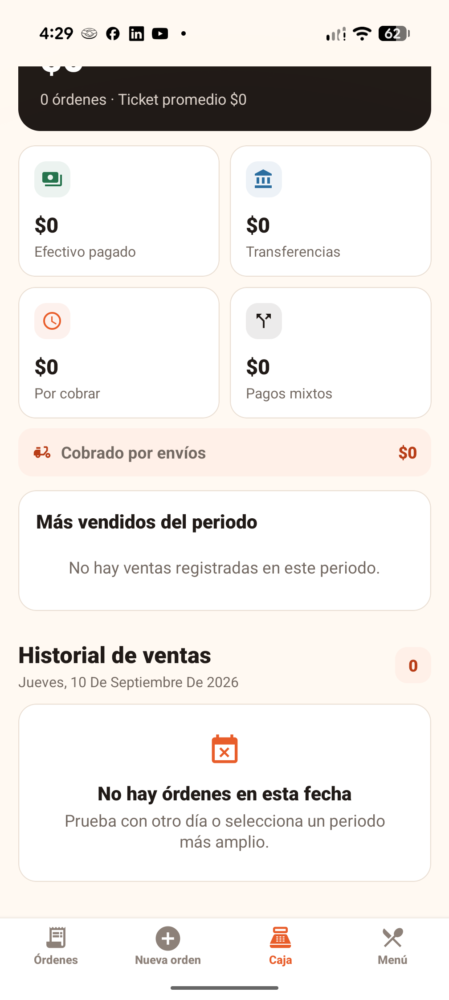

<p align="center">
  
</p>

<h1 align="center">TaqueControl</h1>

<p align="center">
  Aplicación móvil para registrar pedidos, administrar el menú y consultar las ventas de una taquería.
</p>

<p align="center">
  
  
  
  
</p>

## Descripción

TaqueControl fue desarrollada para **El Sazón de Mi Tierra**, un negocio familiar que recibe principalmente pedidos por WhatsApp y llamadas. Centraliza la captura de órdenes, el seguimiento de cuentas pendientes, los cobros y la administración del menú en una interfaz sencilla y adaptada a teléfonos Android de diferentes tamaños.

La aplicación funciona con una base de datos local: no necesita conexión permanente a internet para registrar pedidos o consultar el historial.

## Capturas

<table>
  <tr>
    <td align="center"><strong>Órdenes</strong></td>
    <td align="center"><strong>Nueva orden</strong></td>
    <td align="center"><strong>Menú</strong></td>
  </tr>
  <tr>
    <td></td>
    <td></td>
    <td></td>
  </tr>
</table>

<table>
  <tr>
    <td align="center"><strong>Resumen de caja</strong></td>
    <td align="center"><strong>Historial de ventas</strong></td>
  </tr>
  <tr>
    <td></td>
    <td></td>
  </tr>
</table>

## Funcionalidades

### Pedidos

- Registro de pedidos **a domicilio**, **en mesa** o **para recoger**.
- Carrito con cantidades editables y nombre completo de cada producto.
- Cuentas pagadas o pendientes de pago.
- Edición y eliminación de cuentas pendientes.
- Identificación del cliente, teléfono, dirección, mesa y notas especiales.
- Registro del origen del pedido: WhatsApp, llamada o en persona.
- Costo de envío independiente del subtotal.

### Importación desde WhatsApp

- Lectura de mensajes copiados al portapapeles.
- Detección local de productos, categorías y cantidades.
- Comprensión de cantidades escritas con número o con letra.
- Reconocimiento de órdenes de cinco tacos, bebidas por tamaño y carne por peso.
- Tolerancia a errores ortográficos frecuentes.
- Revisión obligatoria antes de agregar los productos a la orden.
- Selección manual cuando el mensaje es ambiguo o le falta una variante.
- Posibilidad de unir varios mensajes del mismo cliente.

> El importador no accede directamente a conversaciones privadas de WhatsApp. La persona copia el mensaje y revisa el borrador generado antes de guardarlo.

### Pagos y tickets

- Pagos en efectivo, transferencia o modalidad mixta.
- Cálculo automático del cambio para pagos en efectivo.
- Separación del importe recibido en efectivo y por transferencia.
- Generación de un ticket de texto con productos, subtotal, envío, total y notas.
- Copia del ticket al portapapeles.
- Envío de cuentas a domicilio mediante WhatsApp o el menú para compartir del sistema.

### Menú editable

- Creación, edición y eliminación de categorías.
- Creación, edición y eliminación de productos.
- Precio, descripción, categoría y disponibilidad configurables.
- Opción para ocultar productos temporalmente sin perder su información.
- Los productos agregados al menú participan automáticamente en el importador de WhatsApp.

### Caja e historial

- Resumen de venta total y ticket promedio.
- Desglose de efectivo, transferencias, pagos mixtos y cuentas por cobrar.
- Total cobrado por envíos.
- Clasificación de productos más vendidos.
- Historial agrupado por fecha.
- Filtros para hoy, ayer, últimos 7 días, últimos 30 días o una fecha específica.

## Tecnologías

| Tecnología | Uso en el proyecto |
| --- | --- |
| [React Native 0.81](https://reactnative.dev/) | Interfaz móvil y componentes nativos. |
| [React 19](https://react.dev/) | Estado, composición y ciclo de vida de la interfaz. |
| [Expo SDK 54](https://docs.expo.dev/versions/v54.0.0/) | Entorno de desarrollo, herramientas nativas y compilación. |
| [Expo Router 6](https://docs.expo.dev/versions/v54.0.0/router/introduction/) | Navegación basada en archivos. |
| [TypeScript 5.9](https://www.typescriptlang.org/) | Tipado estático y seguridad durante el desarrollo. |
| [Expo SQLite](https://docs.expo.dev/versions/v54.0.0/sdk/sqlite/) | Persistencia local de categorías, productos, órdenes y partidas. |
| [Expo Clipboard](https://docs.expo.dev/versions/v54.0.0/sdk/clipboard/) | Importación de mensajes y copia de tickets. |
| [React Navigation](https://reactnavigation.org/) | Navegación inferior y estructura de pantallas. |
| [Material Icons](https://icons.expo.fyi/) | Iconografía de la interfaz. |
| [EAS Build](https://docs.expo.dev/build/introduction/) | Generación de APK de prueba y compilaciones de producción. |
| ESLint | Revisión automática del código. |

## Arquitectura y almacenamiento

- Las pantallas se encuentran en `app/` y siguen la estructura de Expo Router.
- Los componentes reutilizables están en `components/`.
- La lógica de negocio, tipos, tickets y acceso a datos está en `lib/`.
- Los colores y reglas responsivas están centralizados en `constants/`.
- SQLite utiliza tablas separadas para categorías, productos, órdenes y productos de cada orden.
- La base de datos se guarda exclusivamente en el dispositivo y usa migraciones para conservar compatibilidad entre versiones.

## Requisitos

- Node.js 20.19 o superior.
- npm.
- Expo Go para pruebas rápidas, o un dispositivo/emulador Android.
- Una cuenta de Expo únicamente para generar compilaciones mediante EAS Build.

## Instalación

```bash
git clone https://github.com/Azaelprzm/taque-control-mobile.git
cd taque-control-mobile
npm install
npx expo start
```

Después de iniciar Expo puedes:

- Escanear el código QR con Expo Go.
- Presionar `a` para abrir Android.
- Ejecutar `npm run web` para una revisión básica en navegador.

## Comandos disponibles

```bash
npm start          # Inicia Expo
npm run android    # Abre el proyecto en Android
npm run ios        # Abre el proyecto en iOS
npm run web        # Inicia la versión web
npm run lint       # Revisa el código con ESLint
npx tsc --noEmit   # Comprueba los tipos de TypeScript
```

## Generar un APK de prueba

El perfil `preview` de `eas.json` está configurado para distribución interna:

```bash
npx eas-cli@latest login
npx eas-cli@latest build -p android --profile preview
```

Cuando finalice la compilación, EAS mostrará un enlace para descargar e instalar el APK.

## Estructura principal

```text
taque-control-mobile/
├── app/                 # Pantallas y rutas
│   └── (tabs)/          # Órdenes, nueva orden, caja y menú
├── assets/images/       # Iconos e imágenes de la aplicación
├── components/          # Componentes reutilizables
├── constants/           # Tema visual y diseño responsivo
├── docs/screenshots/    # Capturas utilizadas en este README
├── lib/                 # Base de datos, estado y lógica de negocio
├── app.json             # Configuración de Expo
├── eas.json             # Perfiles de compilación
└── package.json         # Dependencias y comandos
```

## Privacidad y limitaciones actuales

- No se envían órdenes, teléfonos ni direcciones a un servidor externo.
- La información permanece en la base de datos del teléfono.
- Desinstalar la aplicación o borrar sus datos puede eliminar el historial local.
- Actualmente no existe sincronización entre varios dispositivos ni respaldo automático.
- El cálculo mostrado corresponde a ventas; todavía no descuenta compras, insumos o gastos operativos.

## Próximas mejoras posibles

- Respaldo y restauración de la base de datos.
- Control de insumos, compras y gastos.
- Reportes de utilidad real.
- Alias editables para mejorar la detección de productos escritos de distintas formas.
- Sincronización opcional entre dispositivos.
- Integración futura con la API oficial de WhatsApp Business.

## Autor

Desarrollado por [Jesús Azael Pérez Martínez](https://github.com/Azaelprzm).

Este proyecto fue creado para el control interno de **El Sazón de Mi Tierra**. Todos los derechos reservados.
